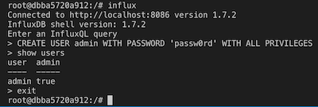
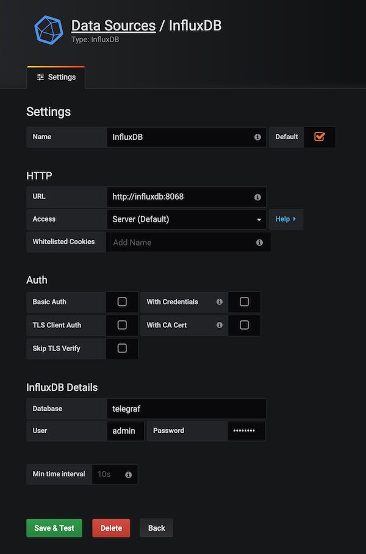
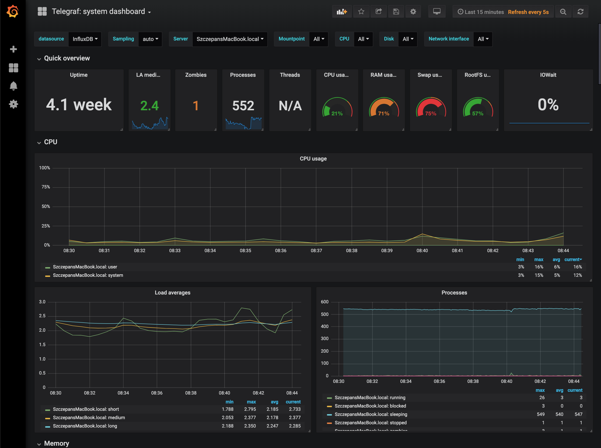
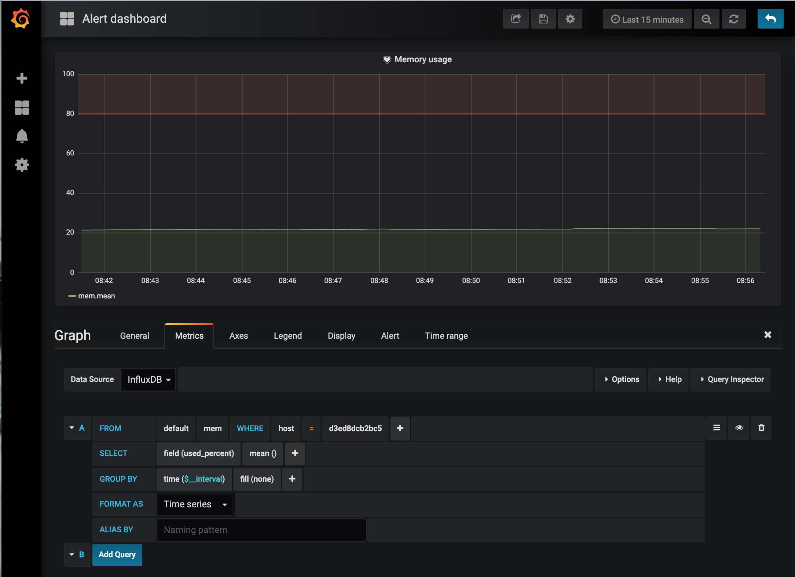
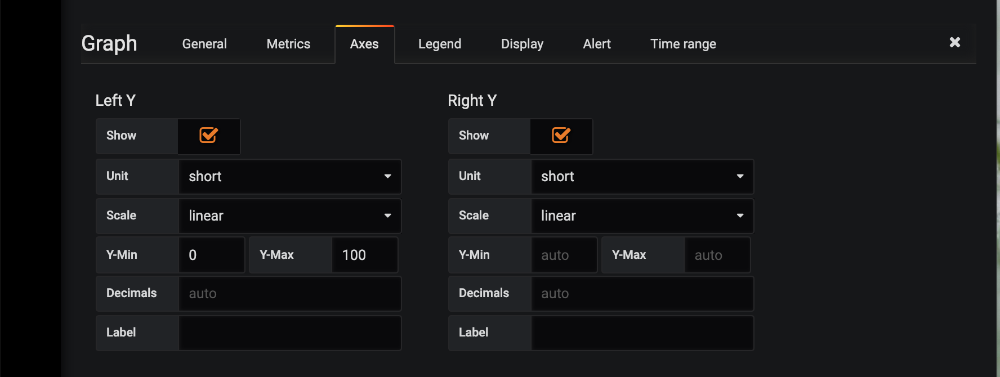
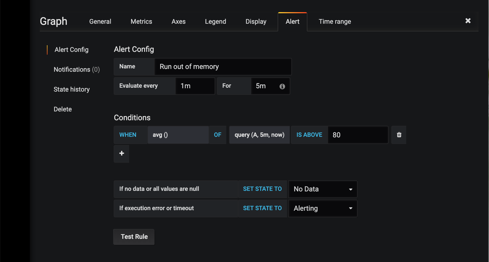

# Rancher server monitoring with TIG Stack

Server monitoring is as important as the content of your server. It allows you to have all the necessary information about its resources in a single view and informs you if they are going to run out before an unpleasant phone call from your boss.

A full case-study about [**How to Set up Rancher Server Monitoring with TIG Stack?**](https://brainhub.eu/blog/rancher-server-monitoring/)

<p align="center">
  
</p>

In this article, I will show you how to set up monitoring of your **Rancher** infrastructure using the **TIG Stack** (**Telegraf**, **InfluxDB** and **Grafana**). If you think that you do not have time for server monitoring, you are wrong. In less then 15 minutes we will have a working dashboard with disk space, memory usage, network traffic, and Docker container metrics and even a simple alert for high memory usage.

> *This tutorial assumes that you have basic knowledge of Docker and Rancher.*

What we need:
* **Telegraf** - for collecting, processing, aggregating and writing metrics
* **InfluxDB** - for storing data
* **Grafana** - for visualization of metrics and creating alerts

## Let's begin by creating a new stack on **Rancher**
1. Create a **docker-compose.yml** file:
```
version: '2'
volumes:
  influxdb:
    driver: local
  grafana:
    driver: local

services:
  influxdb:
    image: influxdb
    volumes:
      - /home/docker/monitoring/influxdb/data:/var/lib/influxdb
      - /home/docker/monitoring/influxdb/config/:/etc/influxdb/
    ports:
      # The API for InfluxDB is served on port 8086
      - "8086:8086"
      - "8082:8082"
      # UDP Port
      - "8089:8089"

  grafana:
    image: grafana/grafana #4.4.2
    environment:
      - GF_INSTALL_PLUGINS=grafana-clock-panel,grafana-worldmap-panel,grafana-piechart-panel
      - GF_SMTP_ENABLED=true
      - GF_SMTP_HOST=<SMTP_HOST_ADDRESS:SMTP_PORT>
      - GF_SMTP_USER=<SMTP_USERNAME>
      - GF_SMTP_PASSWORD=<SMTP_SMTP_PASSWORD>
      - GF_SMTP_FROM_ADDRESS=<SMTP_FROM_ADDRESS>
      - GF_SMTP_FROM_NAME=<SMTP_FROM_NAME>
    links:
      - influxdb:influxdb
    ports:
      - "3000:3000"
    volumes:
      - /home/docker/monitoring/grafana/data:/var/lib/grafana
```
All the necessary volumes are defined on top of `docker-compose.yml`. We stick to the convention that all
volumes should be stored inside the `/home/docker/` directory so change them if you have a different convention. If you do not have `SMTP` configured, remove all `GF_SMTP_*` environment variables from **grafana container**.

2. Add new stack in **Rancher** and upload the `docker-compose.yml` file

## Grafana
Your **Grafana** container probably has some errors. View logs from the container, you will most likely find an issue with permissions, to solve it do the following:
1. Enter the **Grafana** container and make a directory `grafana/data`
2. Change the owner of this directory
```sh
chown 472:472 -R data
```
3. Restart the grafana container

We will come back to **Grafana** later on.

## InfluxDB
1. Create a `influxdb.conf` file:
```
reporting-disabled = true
bind-address = ":8088"

[meta]
  dir = "/var/lib/influxdb/meta"
  retention-autocreate = true
  logging-enabled = true

[data]
  dir = "/var/lib/influxdb/data"
  wal-dir = "/var/lib/influxdb/wal"
  query-log-enabled = true
  cache-max-memory-size = 1073741824
  cache-snapshot-memory-size = 26214400
  cache-snapshot-write-cold-duration = "10m0s"
  compact-full-write-cold-duration = "4h0m0s"
  max-series-per-database = 1000000
  max-values-per-tag = 100000
  index-version = "tsi1"
  trace-logging-enabled = false

[coordinator]
  write-timeout = "10s"
  max-concurrent-queries = 0
  query-timeout = "0s"
  log-queries-after = "0s"
  max-select-point = 0
  max-select-series = 0
  max-select-buckets = 0

[retention]
  enabled = true
  check-interval = "30m0s"

[shard-precreation]
  enabled = true
  check-interval = "10m0s"
  advance-period = "30m0s"

[monitor]
  store-enabled = true
  store-database = "_internal"
  store-interval = "10s"

[subscriber]
  enabled = true
  http-timeout = "30s"
  insecure-skip-verify = false
  ca-certs = ""
  write-concurrency = 40
  write-buffer-size = 1000

[http]
  enabled = true
  flux-enabled = true
  bind-address = ":8086"
  auth-enabled = false
  log-enabled = true
  write-tracing = false
  pprof-enabled = true
  https-enabled = false
  https-certificate = "/etc/ssl/influxdb.pem"
  https-private-key = ""
  max-row-limit = 0
  max-connection-limit = 0
  shared-secret = ""
  realm = "InfluxDB"
  unix-socket-enabled = false
  bind-socket = "/var/run/influxdb.sock"

[[graphite]]
  enabled = false
  bind-address = ":2003"
  database = "graphite"
  retention-policy = ""
  protocol = "tcp"
  batch-size = 5000
  batch-pending = 10
  batch-timeout = "1s"
  consistency-level = "one"
  separator = "."
  udp-read-buffer = 0

[[collectd]]
  enabled = false
  bind-address = ":25826"
  database = "collectd"
  retention-policy = ""
  batch-size = 5000
  batch-pending = 10
  batch-timeout = "10s"
  read-buffer = 0
  typesdb = "/usr/share/collectd/types.db"
  security-level = "none"
  auth-file = "/etc/collectd/auth_file"

[[opentsdb]]
  enabled = false
  bind-address = ":4242"
  database = "opentsdb"
  retention-policy = ""
  consistency-level = "one"
  tls-enabled = false
  certificate = "/etc/ssl/influxdb.pem"
  batch-size = 1000
  batch-pending = 5
  batch-timeout = "1s"
  log-point-errors = true

[[udp]]
  enabled = true
  bind-address = ":8089"
  database = "udp"
  retention-policy = ""
  batch-size = 5000
  batch-pending = 10
  read-buffer = 0
  batch-timeout = "1s"
  precision = ""

[continuous_queries]
  log-enabled = true
  enabled = true
  run-interval = "1s"
```
2. Enter the **InfluxDB** container
3. Copy the configuration file to `/var/lib/influxdb/influxdb.conf`
4. Restart the influx container
5. Enter the container again
6. Type `influx` to start using the influx CLI
7. Add a new user
```
CREATE USER <INFLUXDB_USERNAME> WITH PASSWORD '<INFLUXDB_PASSWORD>' WITH ALL PRIVILEGES
```
8. Type `exit` to exit the CLI

<p align="center">
  
</p>

9. Open `influxdb.config` again and change `auth-enabled` to `true` in the `[http]` section
```
[http]
  ...
  auth-enabled = true
```
10. Exit and restart the influx container
> Next time you would like to use **influx CLI** you will have to specify the `username` and `password`
```
influx -username INFLUXDB_USERNAME -password INFLUXDB_PASSWORD
```

Now your **InfluxDB** is ready to collect server monitoring data.

## Telegraf

1. Install **Telegraf** on your server. For Ubuntu you can use following commands:
```
curl -sL https://repos.influxdata.com/influxdb.key | sudo apt-key add -
source /etc/lsb-release
echo "deb https://repos.influxdata.com/${DISTRIB_ID,,} ${DISTRIB_CODENAME} stable" | sudo tee /etc/apt/sources.list.d/influxdb.list
sudo apt-get update && sudo apt-get install telegraf
  ```
To read more about installation read the [Telegraf installation guide](https://docs.influxdata.com/telegraf/v1.9/introduction/installation/)

2. Create a `telegraf.conf` file:
```
[agent]
  interval = "5s"
  round_interval = true
  metric_batch_size = 1000
  ## Telegraf will cache metric_buffer_limit metrics for each output, and will
  ## flush this buffer on a successful write.
  metric_buffer_limit = 10000
  ## Collection jitter is used to jitter the collection by a random amount.
  ## Each plugin will sleep for a random time within jitter before collecting.
  ## This can be used to avoid many plugins querying things like sysfs at the
  ## same time, which can have a measurable effect on the system.
  collection_jitter = "0s"
  ## Default flushing interval for all outputs. You shouldn't set this below
  ## interval. Maximum flush_interval will be flush_interval + flush_jitter
  flush_interval = "5s"
  ## Jitter the flush interval by a random amount. This is primarily to avoid
  ## large write spikes for users running a large number of telegraf instances.
  ## ie, a jitter of 5s and interval 10s means flushes will happen every 10-15s
  flush_jitter = "0s"
  precision = ""
  ## Run telegraf in debug mode
  debug = false
  ## Run telegraf in quiet mode
  quiet = false
  logfile = ""
  ## Override default hostname, if empty use os.Hostname()
  hostname = ""
  omit_hostname = false

###############################################################################
#                                  OUTPUTS                                    #
###############################################################################
[[outputs.influxdb]]
  urls = ["http://localhost:8086"]
  database = "<INFLUXDB_DATABASENAME>"
  username = "<INFLUXDB_USERNAME>"
  password = "<INFLUXDB_USERNAME>"
  retention_policy = ""
  write_consistency = "any"
  timeout = "5s"

###############################################################################
#                                  INPUTS                                     #
###############################################################################
# Read metrics about cpu usage
[[inputs.cpu]]
  # Whether to report per-cpu stats or not
  percpu = true
  # Whether to report total system CPU stats or not
  totalcpu = true
  # Comment this line if you want the raw CPU time metrics
  fielddrop = ["time_*"]

# Read metrics about disk usage by mount point
[[inputs.disk]]
  # By default, telegraf gather stats for all mountpoints.
  # Setting mountpoints will restrict the stats to the specified mountpoints.
  mount_points=["/", "/host"]

  # Ignore some mountpoints by filesystem type. For example (dev)tmpfs (usually
  # present on /run, /var/run, /dev/shm or /dev).
  ignore_fs = ["tmpfs", "devtmpfs"]

# Read metrics about disk IO by a device
[[inputs.diskio]]
  # By default, telegraf will gather stats for all devices including
  # disk partitions.
  # Setting devices will restrict the stats to the specified devices.
  # devices = ["sda", "sdb"]
  # Uncomment the following line if you do not need disk serial numbers.
  # skip_serial_number = true

# Read metrics about memory usage
[[inputs.mem]]

# Read metrics about swap memory usage
[[inputs.swap]]

# Read metrics about system load & uptime
[[inputs.system]]

# collects network bond
[[inputs.bond]]

# total number of processes and groups them by status (zombie, sleeping, running, etc.)
[[inputs.processes]]

# Gather metrics about network interfaces
[[inputs.net]]
  ## By default, telegraf gathers stats from any up interface (excluding loopback)
  ## Setting interfaces will tell it to gather these explicit interfaces,
  ## regardless of status. When specifying an interface, glob-style
  ## patterns are also supported.
  ##
  interfaces = ["eth*", "en*", "enp0s[0-1]", "lo"]
  ##
  ## On linux systems telegraf also collects protocol stats.
  ## Setting ignore_protocol_stats to true will skip reporting of protocol metrics.
  ##
  # ignore_protocol_stats = false
  ##

# Get kernel statistics from /proc/stat
[[inputs.kernel]]

[[inputs.netstat]]

#[[inputs.interrupts]]

###############################################################################
#                              SERVICE INPUTS                                 #
###############################################################################
[[inputs.docker]]
  ## Docker Endpoint
  ##   To use TCP, set endpoint = "tcp://[ip]:[port]"
  ##   To use environment variables (ie, docker-machine), set endpoint = "ENV"
  endpoint = "unix:///var/run/docker.sock"
  ## Containers to include and exclude. Collect all if empty. Globs accepted.
  container_name_include = []
  container_name_exclude = []
  timeout = "5s"
  ## Whether to report for each container per-device blkio (8:0, 8:1...) and
  ## network (eth0, eth1, ...) stats or not
  perdevice = true
  ## Whether to report for each container total blkio and network stats or not
  total = false
   ## Which environment variables should we use as a tag
  # tag_env = ["JAVA_HOME", "HEAP_SIZE"]
  ## Optional TLS Config
  # tls_ca = "/etc/telegraf/ca.pem"
  # tls_cert = "/etc/telegraf/cert.pem"
  # tls_key = "/etc/telegraf/key.pem"
  ## Use TLS but skip chain & host verification
  # insecure_skip_verify = false

[[inputs.influxdb]]
  urls = ["http://localhost:8086/debug/vars"]
```
3. Make sure that you entered correct `urls`, `username` and `passowrd` to your **InfluxDB** in the `[[outputs.influxdb]]` section
```
[[outputs.influxdb]]
  urls = ["http://localhost:8086"]
  database = "<INFLUXDB_DATABASENAME>"
  username = "<INFLUXDB_USERNAME>"
  password = "<INFLUXDB_USERNAME>"
```
4. Upload `telegraf.conf` to your server. In my case the config file is stored in `/etc/telegraf/telegraf.conf`
5. Start the **Telegraf** service, on Ubuntu you can start it via `sudo service telegraf start`
5. Add the **Telegraf** agent to the **Docker** group to get information for dockers.

```
  sudo usermod -aG docker telegraf
```

## Grafana

1. Open grafana, it's on port `3000` by default
2. Default login: admin
3. Default password: admin
4. Add a datasource:
    * Open http://GRAFANA_ADDRESS:3000/datasources
    * Select **influxdb**
    * Set the url to **influxdb** - `http://<INFLUXDB_ADDRESS>:8086`
    * In **InfluxDB Details** type
        * Database: <INFLUXDB_DATABASENAME>
        * User: <INFLUXDB_USERNAME>
        * Password: <INFLUXDB_PASSWORD>
        * Save and Test

<p align="center">
  
</p>

5. Import dashboard:
    * Open http://localhost:3000/dashboard/import
    * Enter `928` in **Grafana Dashboard field**
    * **Load**

<p align="center">
  
</p>

> You can pick one of those [grafana dashboards](https://grafana.com/dashboards). `2738` is quite good for Rancher.

6. Add a notification channel for your server monitoring:
    * E-mail:
         * Open **Alert => Notification Channels**
         * Name: `monitoring`
         * Type: `Email`
         * Add Email Addresses
         * **Save and test**
    * Slack or Mattermost by using a webhook:
        * Name: `slack`
        * Type: `slack`
        * Url: <SLACK_WEBHOOK_URL>
        * **Save and test**
You can find more information about Slack Webhooks [here](https://api.slack.com/incoming-webhooks).

7. Add a sample alert for low disk space:
    * Add a new dashboard
    * Pick Graph
    * Click on **Panel title => Edit**
    * On the bottom panel **Graph => Metrics**
    * In **Data Source** pick **InfluxDB**

    <p align="center">
      
    </p>

    * Or click the **hamburger button** next to the query builder and select **Toggle Edit Mode**
    * Pass a query `SELECT mean("used_percent") FROM "mem" WHERE ("host" = <YOUR_SERVER_NAME>) AND $timeFilter GROUP BY time($__interval) fill(none)`
    * Switch to the **Axes** tab
    * Type `0` to **Y-min** and `100` to **Y-Max**

    <p align="center">
      
    </p>

    * Switch to the **Alert** tab
    * **Create new alert**
    * Type `80` to **IS ABOVE**

    <p align="center">
      
    </p>

    * Select notification channels
    * Save the dashbord by clicking on the **disk** icon from the top bar


Now you will be informed when memory usage is above 80% for more than 5 minutes. Was it so hard to set up a full working server monitoring system for your **Rancher**? Now you are ready to install multiple **Telegraf** instances on your `dev` or `test` servers and see everything in a single **Grafana**.

## Summary

TIG Stack is a combination of really great tools for server monitoring that can save you a lot of time, problems and effort. Combined with **ELK Stack** (**Elasticsearch**, **Logstash** and **Kibana**) it gives you a nice set of tools for both visualizing metrics and analyzing log messages. You can continue further by adding a load balancer instead of exposing ports.


A working project can be downloaded from [github](https://github.com/brainhubeu/monitoring-rancher).

## License

React-permissible is copyright © 2014-2019 [Brainhub](https://brainhub.eu/?utm_source=github) It is free software, and may be redistributed under the terms specified in the [license](LICENSE.md).

## About

It is funded by Brainhub and the names and logos for Brainhub are trademarks of Brainhub Sp. z o.o.. You can check other open-source projects supported/developed by our teammates [here](https://brainhub.eu/?utm_source=github). 

[](https://brainhub.eu/?utm_source=github)

We love open-source JavaScript software! See our other projects or hire us to build your next web, desktop and mobile application with JavaScript.
